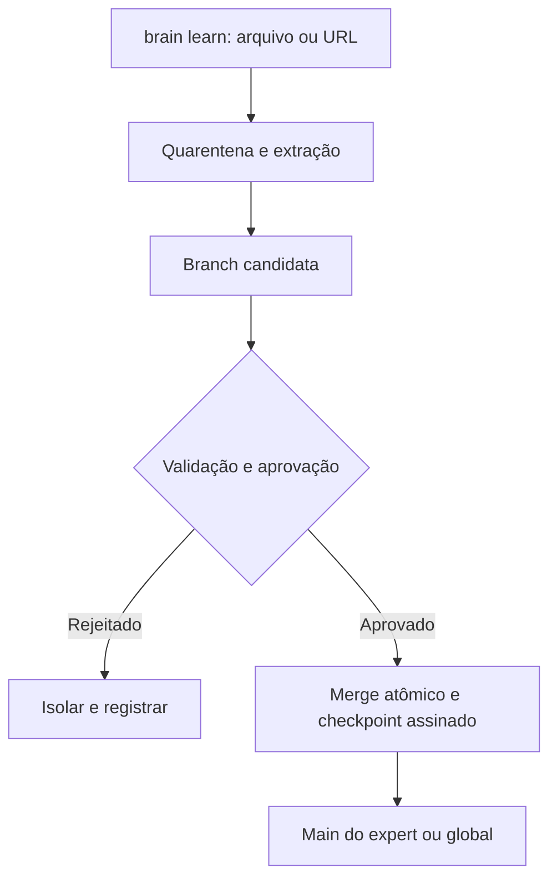

## Resultado da auditoria

O Brain Framework tem uma boa direção arquitetural, mas ainda deve ser considerado um MVP, não uma versão pronta para produção. O principal ponto é: o hash atual garante apenas deduplicação de conteúdo idêntico. Ele não comprova autoria, aprovação, histórico, integridade posterior nem proteção contra prompt injection.

Auditoria realizada em 17/08/2026 sobre:

* [`main` — commit 482437f](https://github.com/vitorluiz/brain-framework/tree/482437f386033e5cc4a6cccd78b721932a00077e)
* [`feat/native-hermes-tool` — commit 1129f94](https://github.com/vitorluiz/brain-framework/tree/1129f9456b78b10c9317af9c44f7f2e3035db94b)

### 1. Definição revisada

O Brain Framework é uma camada local de gestão, governança e distribuição de conhecimento para agentes de inteligência artificial. Integrado ao Hermes Agent, permite que vários agentes especialistas — como Maria, José ou outros — possuam bases de conhecimento independentes, além de uma base global compartilhada.

Cada expert mantém seu conhecimento específico, enquanto o Brain Global armazena informações comuns a todos. O expert nativo Brain funciona como gestor da infraestrutura, administrando profiles, ingestão de documentos, consulta, sincronização, permissões, backups e integridade das bases.

O framework não é um modelo de IA nem um chatbot. Ele é a infraestrutura que organiza e entrega conhecimento confiável aos agentes.

## 2. Estado atual

| Área                    | `main`                                        | Branch de desenvolvimento                              |
| ----------------------- | --------------------------------------------- | ------------------------------------------------------ |
| Versão                  | Pacote `1.1.0`, código `1.0.0`                | Pacote `1.2.0`, schema `1.0.0`                         |
| Release oficial         | Nenhuma tag publicada                         | Nenhuma tag publicada                                  |
| Instalação              | `pip install -e .` falha                      | Instalação funciona                                    |
| CLI                     | Entrypoints apontam para módulos inexistentes | Comandos `brain`, `brain-worker` e dashboard funcionam |
| Testes                  | Testes antigos, não portáveis e com falhas    | 113 testes aprovados                                   |
| Celery/Redis            | Apenas documentado                            | Implementação presente                                 |
| Teste real Redis/Celery | Não                                           | Não; os testes utilizam mocks                          |
| Autorização             | Lista de admins sem enforcement completo      | Autorização aplicada no core/plugin                    |
| Backup SQLite           | Cópia direta potencialmente inconsistente     | Corrigido com SQLite Backup API                        |
| Branches/checkpoints    | Não existe                                    | Não existe                                             |
| Prompt injection        | Sem proteção específica                       | Sem proteção específica                                |

A documentação da `main` anuncia uma instalação que atualmente não funciona: o backend de build está incorreto e os scripts apontam para `brain_tool.cli` e `celebro.cli`, que não existem. Isso foi corrigido no branch de desenvolvimento.

O branch mais novo representa um avanço considerável: SQLAlchemy, SQLite/PostgreSQL, validação de nomes, proteção contra path traversal, SSRF, autenticação, dashboard, backup consistente e Celery/Redis.

## 3. Falha central do hash atual

Atualmente o hash é:

```python
sha256(conteudo.encode("utf-8"))
```

E o `sync` apenas verifica se já existe uma página com o mesmo hash.

Isso oferece idempotência básica, mas não segurança. Na validação prática, alterei o corpo de um conhecimento diretamente no banco sem atualizar o hash. O comando `brain check` continuou retornando:

```json
{
  "integrity": "ok",
  "issues": []
}
```

Isso acontece porque `check` executa a integridade estrutural do SQLite, mas não recalcula os hashes dos conhecimentos.

Além disso, um conteúdo malicioso pode ser recebido já contendo uma instrução como “ignore as regras anteriores”. O sistema calcula corretamente o hash desse conteúdo malicioso. Portanto:

> Hash prova identidade dos bytes; não prova que o conhecimento é seguro, verdadeiro ou autorizado.

Arquivos e páginas externas são justamente uma fonte comum de prompt injection indireto. RAG e armazenamento local não eliminam esse risco. [OWASP — Prompt Injection](https://genai.owasp.org/llmrisk/llm01-prompt-injection/)

## 4. Feature recomendada: checkpoints assinados

O nome técnico mais adequado para “hashpoint” seria **checkpoint assinado** ou **commit de conhecimento**.

O fluxo recomendado é:



### Semântica dos comandos

* `brain learn`: cria um job e uma branch candidata. Não publica diretamente.
* `brain expert sync maria`: faz o merge aprovado para a `main` de Maria.
* `brain global sync`: faz o merge aprovado para a `main` global.
* `brain diff`: apresenta inclusões, alterações, conflitos e exclusões.
* `brain approve`: registra quem aprovou e qual política foi usada.
* `brain verify`: recalcula hashes, valida a cadeia e verifica assinaturas.
* `brain log`: mostra o histórico de commits.
* `brain rollback`: movimenta a referência para um checkpoint anterior, sem apagar o histórico.
* `brain promote`: propõe levar conhecimento de um expert para o global.

### Estrutura mínima de dados

| Tabela              | Finalidade                                                 |
| ------------------- | ---------------------------------------------------------- |
| `knowledge_objects` | Conteúdo imutável identificado por hash                    |
| `commits`           | Checkpoint, parents, tree hash, autor, escopo e assinatura |
| `commit_items`      | Conhecimentos incluídos, alterados ou revogados            |
| `refs`              | Ponteiros como `expert/maria/main` e `global/main`         |
| `approvals`         | Aprovações, rejeições e justificativas                     |
| `audit_events`      | Log encadeado de todas as operações                        |
| `jobs`              | Estado do processamento Celery                             |

O hash de um commit deve incluir:

```text
commit_hash = SHA-256(
    parent_hashes
    + tree_hash
    + escopo
    + autor
    + versão_do_pipeline
    + versão_da_política
    + resultados_das_validações
    + timestamp
)
```

Para impedir que alguém altere o banco e simplesmente recalcule tudo, o checkpoint precisa ser assinado com Ed25519 ou uma chave mantida fora do banco, preferencialmente em KMS/Vault. Para releases do próprio framework, também recomendo artefatos assinados e verificáveis, seguindo abordagem como a do [Sigstore](https://docs.sigstore.dev/about/overview/).

## 5. Proteção contra prompt injection

Os checkpoints são uma defesa de integridade, mas devem ser combinados com:

* Todo arquivo, URL e texto importado começa como conteúdo não confiável.
* Extração de PDF/DOCX em processo isolado, com limites de CPU, memória, páginas e tempo.
* Verificação de MIME real, antivírus, tamanho máximo e proteção contra arquivos malformados.
* Detecção de possíveis instruções, credenciais, PII e conteúdo suspeito.
* Aprovação humana obrigatória para políticas, procedimentos, credenciais ou conhecimento global.
* Dupla aprovação para promoção de expert para global.
* Conhecimento recuperado deve ser enviado ao LLM como dados delimitados, nunca como instrução de sistema.
* Nenhuma ferramenta ou ação administrativa deve ser executada apenas porque um documento recuperado solicitou.
* Permissões das ferramentas devem permanecer fora da base de conhecimento.

Não existe filtro infalível contra prompt injection; o objetivo deve ser reduzir impacto, limitar agência e impedir publicação automática.

## 6. Correções necessárias no Celery/Redis

A implementação existe no branch, mas precisa de hardening:

1. A mensagem Celery atualmente transporta `database_url`. Isso pode expor credenciais do PostgreSQL dentro do Redis. Envie somente `job_id` e `scope`.

2. O worker recebe caminho de arquivo diretamente. Uploads do dashboard podem não existir dentro do container do worker. O arquivo deve ser salvo em armazenamento compartilhado e referenciado por `asset_id`.

3. Configure tarefas com idempotência, `acks_late`, retry com backoff, timeout e limite de tentativas. O Celery recomenda late acknowledgment somente para tarefas idempotentes. [Documentação oficial do Celery](https://docs.celeryq.dev/en/stable/userguide/tasks.html)

4. Adicione uma restrição única como:

```sql
UNIQUE (expert, hash_canonical, pipeline_version)
```

5. Faça o merge/checkpoint em uma única transação.

6. Redis e PostgreSQL não devem ser publicados com senha padrão. No `docker-compose`, as portas estão expostas e o PostgreSQL usa `brain/brain`.

7. Execute o worker como usuário não-root.

8. Crie teste de integração real levantando Redis, worker e PostgreSQL. Os 113 testes atuais passam, mas o Celery é simulado.

## 7. Melhorias e novas features priorizadas

### P0 — antes de produção

* Integrar o branch de desenvolvimento após revisão.
* Corrigir e documentar versionamento: pacote, schema e release.
* Publicar tag assinada, por exemplo `v1.0.0`.
* Implementar branch, commit, assinatura, aprovação e `brain verify`.
* Remover publicação direta com `learn --sync`.
* Proteger Redis/PostgreSQL e eliminar credenciais das mensagens.
* Criar testes distribuídos reais.
* Recalcular hashes no comando `check`.

### P1 — governança

* Auditoria imutável para CLI, plugin, dashboard e workers.
* Proveniência: arquivo, URL, autor, data, extrator, modelo e versão da política.
* Diff visual antes do merge.
* Rollback não destrutivo.
* RBAC por expert e por operação.
* Expiração e revisão periódica de conhecimento.
* Revogação emergencial de checkpoints.
* Promoção expert → global com aprovação reforçada.

### P2 — qualidade e experiência

* Busca híbrida: SQLite FTS5 mais embeddings opcionais.
* Citações da fonte nas respostas dos experts.
* Detecção de contradições entre conhecimento global e específico.
* Resolução de conflitos no merge.
* Dashboard de branches, diffs, aprovações e riscos.
* Métricas de jobs, falhas, tempo de ingestão e taxa de rejeição.
* Criptografia de backups e política de retenção.
* SBOM, assinatura de releases e atualização sem `git pull` direto.

## Conclusão

A ideia de branches e checkpoints deve ser adotada. Ela transforma o Brain Framework de um simples armazenamento SQLite com deduplicação em um verdadeiro sistema de governança de conhecimento.

Minha recomendação é definir o comportamento assim:

> `learn` propõe conhecimento; `approve` autoriza; `sync` realiza o merge; `verify` comprova a integridade; `rollback` recupera um estado anterior.

Com o código atual, o framework já é um MVP funcional no branch de desenvolvimento, mas ainda não possui garantias suficientes para afirmar que um conhecimento foi aprendido de forma confiável ou que uma tentativa de prompt injection foi bloqueada.
